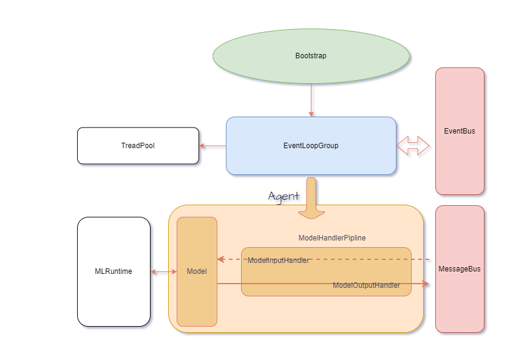

# MLPick-up: An ML Agent framework, using machine learning is like tuning a library

<p align="center">
<a href=""></a>
</p>

<p align="center">
<b>Provide generic templates for different machine learning tasks, users only need to focus on the business</b>
</p>

## Note

## Immature ideas


## 🚀 [Features](https://localai.io/features/)

- 📖 Agent
- 🗣 Redis,vector database
- 🔈 Message bus, communication module
- 🎨 Data processing pipeline
- 🔥 Hugging face
- 🧠 LLM
- ✍️ Task Scheduler
- 🖼️ ML Runtime

## Examples

```C#
//initialization
public async Task Init()
        {
            IEventLoopGroup _group = new MultithreadEventLoopGroup(1);
            var inputPoint = new EventBus(key, hashvalue);// bus point
            _bootstrap = new Bootstrap();
            _bootstrap
                .Group(_group)
                .Agent<DefaultAgent>() // Default model
                .Option(AgentOption.AutoML, false) //auto-training
                .Option(AgentOption.OnlyOut, true) //No data entry required
                .Option(AgentOption.Timers, 1000) //1 second timed trigger
                .Handler(new ActionChannelInitializer<IAgent>(c =>
                {
                    IAgentPipeline pipeline = c.Pipeline;
                    pipeline.AddList(...)
                }));
            
            try
            {
                Push = await _bootstrap.BindAsync(inputPoint);//Open Listening
                if (!Push.Active)
                {
                    await Push.CloseAsync();
                }
            }
            catch(Exception e)
            {
                string s = e.ToString();
            }
        }
```


## 📖 License
- MIT

## 🤗 Contributors
Welcome to submit your code!
